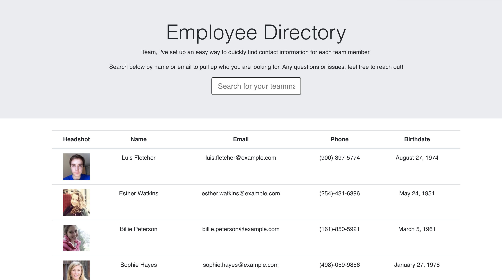
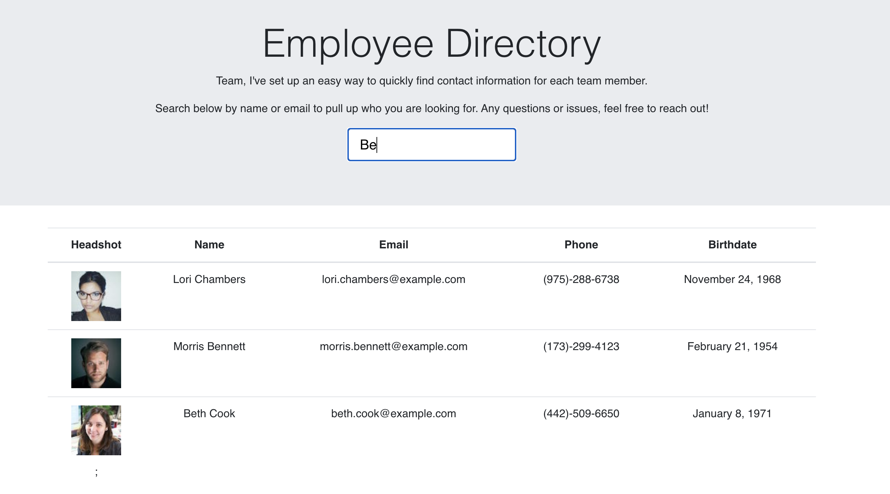
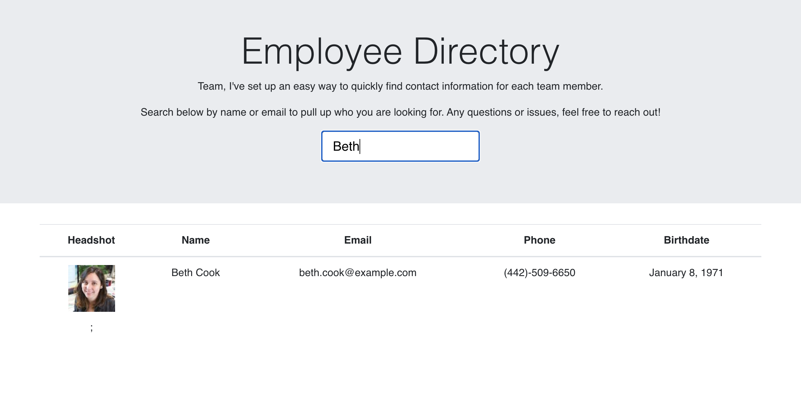

# React Employee-Directory

## User Story

As a user, I want to be able to view my entire employee directory at once so that I have quick access to their information.

## Business Context

An employee or manager would benefit greatly from being able to view non-sensitive data about other employees. It would be particularly helpful to be able to filter employees by name.

## GitHub Repository Link

<https://github.com/brandonln53/React-Employee-Directory>

## Deployed Link

<https://blooming-reef-79097.herokuapp.com/>

## Acceptance Criteria

Given a table of random users, when the user loads the page, a table of employees should render.

The user should be able to:

* Sort the table by at least one category

* Filter the users by at least one property.

## Screenshots

